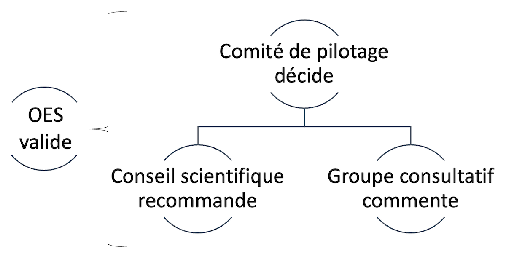

```{r setup, include=FALSE}
options(htmltools.dir.version = FALSE)
knitr::opts_chunk$set(
  fig.width = 9, fig.height = 3.5, fig.retina = 3,
  out.width = "100%",
  cache = FALSE,
  echo = TRUE,
  message = FALSE,
  warning = FALSE,
  fig.show = TRUE,
  hiline = TRUE
)
```

```{r xaringan-themer, include=FALSE, warning=FALSE}
library(xaringanthemer)
style_duo_accent(
  primary_color = "#D2202B",
  secondary_color = "#D2202B",
  inverse_header_color = "#FFFFFF",
  link_color = "#676C72",
    header_font_google = google_font("Josefin Sans")

)
```

class: title-slide, inverse, bottom
background-image: url(`r rmarkdown::metadata$url_unsplash`)
background-size: cover

# `r rmarkdown::metadata$title`

## `r rmarkdown::metadata$subtitle`

### `r rmarkdown::metadata$team`

### `r rmarkdown::metadata$date`

---
class: about-me, middle, center


## Formation continue HEP-VS

[`r icons::fontawesome("link")` `r basename(rmarkdown::metadata$url_website)`](`r rmarkdown::metadata$url_website`)</br>
[`r icons::fontawesome("user-lock")` Stockage du projet (RII)](`r rmarkdown::metadata$url_intranet`)
---
class: inverse, middle left

# Ordre du jour

--

### 1. En bref...

--

### 2. Affaires courantes

--

### 3. Mise en pratique de la formation (révision de la partie C)

--

### 4. Institutions partenaires (nouveau!)

--

### 5. Prochains jalons Go / No go

--

### 6. Divers

---
class: middle left

# 1. La formation en bref...

--

### Mandat

Formation de 44 heures réparties en 4 parties (ou modules) 

Contenus : TSA, troubles et neurosciences, compétences psychosociales, connaissance d'outils

--

### Autonomie des personnes

3 sessions

Comodal 

--

### Alternance théorie-pratique forte

Contenus académiques

Connexion avec la culture d'établissement

---
class: middle left

# 2. Affaires courantes

--

.pull-left[

- Organes formalisés: comité de pilotage, conseil scientifique, groupe consultatif

- Montée en puissance: attribution de ressources internes

- Rédaction "procédure d'inscriptions et masse critique" (en cours)

- Rédaction "cours accéléré pour les futur·es engagé·es" (en cours)

- Rédaction "connexions avec le MAES Bas-Valais" (en cours)

]

--

.pull-right[

- Élaboration d'un cadre de fonctionnement avec les institutions partenaires pressenties

- Identité de la formation: nom, visuels

- Réflexions sur la possibilité de formaliser la formation

- Formalisation de l'organigramme (pouvoir décisionnel)

]


---
class: middle, center

```{r out.width = '75%', echo=FALSE}
# local

```

---

class: inverse, middle left

# 3. Mise en pratique (ancienne "partie C")

--

<!-- La partie C pourrait être une communauté de pratiques qui se revoit quelques mois plus tard....une seule fois. Et est-ce que entre temps, on devrait pas exiger un projet ! les gens devraient soumettre un projet à la fin des 4 modules. Un truc qu'il va mettre en oeuvre ! Et on impique jamais les responsables dans le canton. -->

<!-- Les ateliers pratiques pourraient être une sorte de moment de témoignage de personnes-clés où on voit des personnes "qui savent mettre en oeuvre". -->

## Pendant...

- Injection de témoignages dans chaque module (sous forme d'analyse de cas, de vidéo, d'intervention directe)

--

## Puis pour clore la formation...

- Livraison d'un projet de mise en œuvre d'un ou plusieurs apports de la formation dans l'établissement
- Encouragement à livrer un projet mutualisé
- Mise à disposition d'un canevas de projet soutenant la mise en pratique et l'identification des freins/leviers

--

## Et ensuite...

- Mise à disposition d'une zone de ressources (Sharepoint ICT-VS géré par l'OES)
- Sélection et mutualisation des projets (Sharepoint ICT-VS)
- Encouragement du maintien de communautés de pratiques (rencontres semestrielles facilitées)

---
class: middle left, inverse

# 4. Institutions partenaires (nouveau!)

--

## IPC (UNFIR)
## UniDistance

--

## Enjeux : 

- Place dans le comité de pilotage
- Rôle décisionnel


---

class: middle left

# 5. Prochains jalons Go / No go

--

.pull-left[

## Positionnement

- Rôle du conseil scientifique

- Participation partielles des enseignant·es en formation MAES

- Caractère fixe des 3 sessions (en fonction des coûts)

- Partenaires institutionnels

- Aspect "pratique" de la formation

- Chiffres-clés sur le public-cible (total, par catégories)

- Obtention et utilisation des adresses @edu.vs.ch

]

--

.pull-right[

## Dates-clés

- Septembre 2021: Validation financière du projet, validation du concept de formation &#x1f7e0;

- Octobre 2021: Démarrage des organes de formation &#x1F7E2;

- 1.12 (CS) ;  6.12 (GC) ; 10.01 (CS) ; 11.01 (GC)

- Janvier 2022: Validation des équipes de formation &#x1f7e0;

- Février 2022: Validation de la première communication aux ES par l'OES sur proposition de la HEP-VS &#x1f7e0;

]

---

class: middle left

# 6. Divers

---

class: middle,  

## Merci pour votre attention!


```{r out.width = '10%', echo=FALSE}
# local

```
